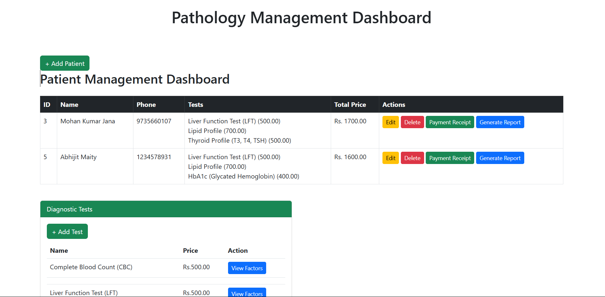

# 🏥 **PathoCare - Pathology Management System**  

A **Django-based web application** designed for local pathology labs to **manage diagnostic tests, patient records, and automated test reports**. This system streamlines pathology operations with **digital test records, automatic result evaluation, and PDF report generation**.

## 🚀 **Features**  
✅ **Patient Management** – Store patient details, test history, and reports  
✅ **Test Management** – Add and manage diagnostic tests with predefined normal values  
✅ **Automated Report Generation** – Generate PDF test reports dynamically  
✅ **Result Analysis** – Compare test values with normal ranges and mark abnormalities  
✅ **Secure Access** – Admin panel for managing records and users  
✅ **User-Friendly Interface** – Clean and interactive UI for easy navigation  

## 🛠️ **Tech Stack**  
🔹 **Backend** – Django, Django REST Framework  
🔹 **Database** – SQLite / PostgreSQL  
🔹 **Frontend** – HTML, CSS, JavaScript (Bootstrap)  
🔹 **PDF Generation** – ReportLab  
🔹 **Authentication** – Django’s built-in user system  

## 🔧 **Installation & Setup**  
1️⃣ Clone the repository:  
   ```bash
   git clone https://github.com/your-username/pathocare.git
   cd pathocare
   ```  
2️⃣ Create a virtual environment & install dependencies:  
   ```bash
   python -m venv venv
   source venv/bin/activate  # (Windows: venv\Scripts\activate)
   pip install -r requirements.txt
   ```  
3️⃣ Apply migrations & create a superuser:  
   ```bash
   python manage.py migrate
   python manage.py createsuperuser
   ```  
4️⃣ Run the server:  
   ```bash
   python manage.py runserver
   ```  
5️⃣ Access the app at **http://127.0.0.1:8000/**  

---

## 📸 **Screenshots** 



---

### 💡 **Future Enhancements**  
🔹 Integration with SMS/Email notifications for report delivery  
🔹 Multi-user roles (Doctors, Lab Technicians, Patients)  
🔹 Improved analytics & insights  

---

📝 **Developed By:** Sudip 🚀  
Feel free to contribute and improve! **Pull requests are welcome.** 😊  
